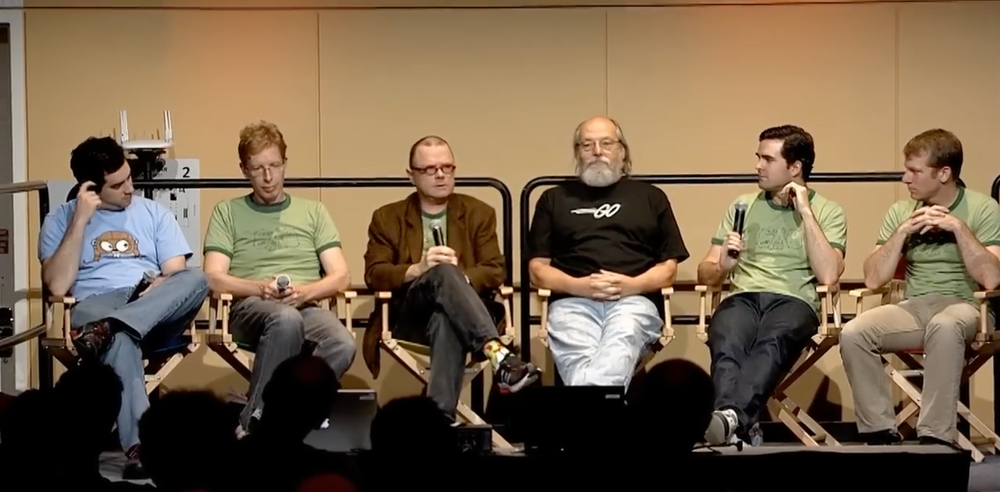

# Quiz questions

_View source to see correct answers_

## 1. When was Go 1.0 released?

- March 2012 <!-- Correct -->
- September 2012
- March 2013
- September 2013

## 2. What does this program print?

```go
package main

import (
	"fmt"
	"time"
)

func main() {
	sec := 0.5
	fmt.Println(time.Duration(sec) * time.Second)
}
```

- 0s <!-- Correct -->
- 0.5s
- 500ms
- Doesn't compile

## 3. Who is NOT in this photo?



- Rob Pike
- Russ Cox <!-- Correct -->
- Ken Thompson
- Robert Griesemer

## 4. What does this program print?

```go
package main

import (
	"fmt"
	"math"
)

func main() {
	fmt.Println(math.NaN() == math.NaN())
	fmt.Println(math.Inf(1) == math.Inf(1))
}
```

- false, false
- true, false
- false, true <!-- Correct -->
- true, true

## 5. Which one of these is a valid time format?

- `time.Kitchen` <!-- Correct -->
- `time.Wall`
- `time.ISO8601`
- `time.Unix`

## 6. What does this program print?

```go
package main

import "fmt"

func main() {
	const x any = byte(123)
	
	switch x.(type) {
	case uint8:
		fmt.Println("uint8")
	case byte:
		fmt.Println("byte")
	default:
		fmt.Println("other")
	}
}
```

- uint8
- byte
- other
- Doesn't compile <!-- Correct -->

## 7. Go is the first language with the defer keyword

- True <!-- Correct -->
- False

## 8. What does this program print?

```go
package main

import (
	"encoding/json"
	"fmt"
	"time"
)

type Packet struct {
	time.Time
	Payload string
}

func main() {
	p := Packet{Payload: "pizza"}
	j, _ := json.Marshal(p)
	fmt.Println(string(j))
}
```

- `{"Payload": "pizza"}`
- `{"Time": "", "Payload": "pizza"}`
- `{"Time": "0001-01-01T00:00:00Z", "Payload": "pizza"}`
- `0001-01-01T00:00:00Z` <!-- Correct -->

## 9. Before Go modules, this environment variable determined where to find source code

- `GOPATH` <!-- Correct -->
- `GOSRC`
- `GOROOT`
- `GOHOME`

## 10. What does this program print?

```go
package main

import (
	"fmt"
)

func main() {
	i := 5
	defer fmt.Println(i)
	i = i + 10
}
```

- 5 <!-- Correct -->
- 15
- 10
- 0

## 11. The Go Language Server Protocol server is..

- gols
- go tool lsp
- golsp
- gopls <!-- Correct -->

## 12. What does this program print?

```go
package main

import (
	"fmt"
)

const iota = 5

const (
	a = iota
	b = iota
)

func main() {
	fmt.Println(a, b)
}
```

- Doesn't compile
- 0 1
- 5 5 <!-- Correct -->
- 5 6

## 13. How do you run all tests except one?

- `go test -run !Example`
- `go test -skip Example` <!-- Correct -->
- `go test -excl Example`
- Not possible (have to opt-in with `-run`)

## 14. What does this program print?

```go
package main

import (
	"fmt"
	"unicode/utf8"
)

func main() {
	family := "👨‍👩‍👧‍👦"
	fmt.Println(len(family))
	fmt.Println(utf8.RuneCountInString(family))
}
```

- 1, 1
- 4, 1
- 25, 7 <!-- Correct -->
- 19, 4

## 15. gopls natively supports

(multiple choice)

- gofumpt <!-- Correct -->
- staticcheck <!-- Correct -->
- vulncheck <!-- Correct -->
- HTML documentation <!-- Correct -->

## 16. What does this program print?

```go
package main

import (
	"fmt"
)

func main() {
	var x = [...]int{2: 4}
	fmt.Println(len(x))
}
```

- 1
- 2
- 3 <!-- Correct -->
- 4

## 17. How many redirects does `http.DefaultClient` follow?

Slider 0-10 <!-- Correct: 10 -->

## 18. Which of these are Go proverbs from Rob Pike's 2015 Gopherfest talk?

(multiple choice)

- The bigger the interface, the weaker the abstraction <!-- Correct -->
- Accept interfaces, return structs
- Clear is better than clever <!-- Correct -->
- Documentation is for users <!-- Correct -->

Thanks for playing 🎉
